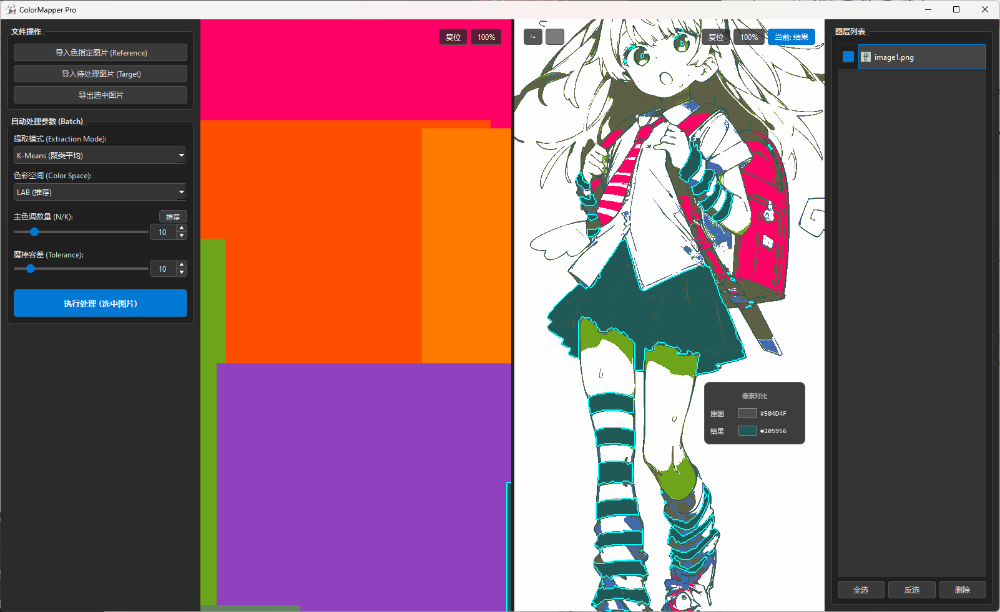

# 🎨 ColorMapper Pro

> **Unified Color Palette Tool for Illustrators & Animators**
> 
> 极简风插画/动画色彩统一工具 —— 消除 AI 生成图与设定稿之间的色差。


<br>
<p align="center">
  
</p>
<br>
## 📖 简介 (Introduction)

**ColorMapper Pro** 是一款专为插画师和动画师设计的桌面应用程序。它的核心目标是解决\*\*“色彩不一致”\*\*的问题。

在现代创作流程中，我们经常面临这样的场景：你拥有一张完美的人物设定稿（Reference），但 AI 生成的中间画或辅助素材（Target）往往带有噪点、杂色，或者色调偏离了原本的设定。手动修整成千上万个像素既耗时又痛苦。

ColorMapper Pro 通过智能算法提取设定稿的主色调，并将目标图片中的每一个像素“强制”映射到设定稿的色彩空间中，从而**一键消除色差，统一画风**。

## ✨ 核心功能 (Key Features)

  * **⚡ GPU 极速加速**: 基于 **CuPy** 框架，利用 NVIDIA 显卡进行矩阵运算，处理 4K 分辨率图片仅需毫秒级响应。
  * **🎨 双重提取模式**:
      * **K-Means 聚类**: 计算颜色的数学平均值，适合去噪和概括，生成平滑的赛璐璐风格。
      * **Histogram 直方图**: 严格选取出现频率最高的真实颜色，确保 100% 还原设定稿色彩，不产生新颜色。
  * **👁️ 多色彩空间支持**: 支持 **LAB** (人眼感知)、**HSV** 和 RGB 空间，确保色彩匹配符合人类视觉习惯。
  * **📂 批量处理**: 队列式处理大量图片，解放双手。
  * **🛠️ 手动精修**: 内置魔棒工具和色板，支持手动指定特定区域的填充颜色。
  * **🖥️ 现代化 UI**: 基于 PyQt6 构建的暗色系界面，支持实时对比预览。

## ⚙️ 技术原理 (How it Works)

ColorMapper Pro 的工作流程既简单又硬核。为了让大家都能理解，这里用通俗与专业两种方式解释：

<p align="center">
  
</p>

### 1. 色彩提取 (Extraction)
* **通俗版**: 软件像一双“眼睛”，盯着你的设定稿，挑出里面最重要、面积最大的几十种颜色，做成一个“调色盘”。
  * **专业版**:
      * **K-Means**: 使用无监督学习算法对设定稿像素进行聚类，计算出 $K$ 个聚类中心（Centroids）。
      * **Histogram**: 统计像素频率分布，通过覆盖率（Coverage Rate, e.g., 85%）截断长尾颜色，保留高频主色。

### 2\. 色彩映射 (Mapping)

  * **通俗版**: 软件拿着这个“调色盘”，去检查待处理图片的每一个像素。比如它看到一个“有点像红色”的像素，就会在调色盘里找“最像的那个红色”直接替换掉它。
  * **专业版**: 这是一个**向量量化 (Vector Quantization)** 过程。
    1.  将图片转换到 **LAB 色彩空间**（L=亮度, a/b=色彩分量），因为 LAB 空间中的欧氏距离最接近人眼对“色差”的感知。
    2.  计算待处理图中每个像素点 $P(x,y)$ 与调色板中所有颜色 $C_1...C_k$ 的**欧氏距离**。
    3.  找到距离最小的颜色 $C_{best}$，直接替换原像素值。

### 3\. GPU 加速 (The Power of CUDA)

  * **挑战**: 一张 4K 图片约有 800 万个像素。如果调色板有 64 种颜色，CPU 需要进行 $8,000,000 \times 64 \approx 5.12$ 亿次距离计算。这在 Python 中非常慢。
  * **解决方案**: 我们使用 **CuPy** 将图像数据和调色板上传至显存 (VRAM)。利用 GPU 的数千个 CUDA 核心进行**并行广播 (Broadcasting) 计算**。这使得处理速度比传统 CPU 循环快数十倍甚至上百倍。

## 📦 安装与运行 (Installation)

### 方式一：直接运行 (推荐)

下载 Release 页面中的 `ColorMapperPro_Setup.exe` 安装包，解压即用。无需配置 Python 环境。

### 方式二：源码运行

如果你是开发者，希望修改代码：

1.  **环境要求**:

      * Python 3.10+
      * NVIDIA 显卡 (支持 CUDA)
      * CUDA Toolkit (建议 v11.x 或 v12.x)

2.  **安装依赖**:

    ```bash
    # 基础依赖
    pip install PyQt6 opencv-python numpy

    # GPU 加速库 (请根据你的 CUDA 版本选择，例如 CUDA 12.x)
    pip install cupy-cuda12x
    ```

3.  **运行**:

    ```bash
    python main.py
    ```

## 🛠️ 构建 (Build from Source)

如果你想自己打包 exe 文件：

```powershell
# 1. 安装 PyInstaller
pip install pyinstaller

# 2. 执行打包命令 (已包含依赖优化与体积瘦身)
pyinstaller --clean --noconsole --icon="app_icon.ico" --add-data="app_icon.ico;." --name="ColorMapperPro" --exclude-module PyQt5 --exclude-module torch --exclude-module torchvision --exclude-module torchaudio --exclude-module matplotlib --exclude-module scipy.stats --exclude-module scipy.optimize --exclude-module tkinter --collect-all cupy --collect-all cupy_backends --collect-all fastrlock main.py
```

## 📄 开源协议 (License)

本项目采用 **MIT License** 开源协议。
这意味着您可以免费使用、修改、分发本项目，甚至用于商业用途，只需保留原作者版权声明。

## 🙏 致谢 (Acknowledgments)

本项目的诞生离不开以下开源社区的贡献：

  * **[OpenCV](https://opencv.org/)**: 强大的图像处理库。
  * **[PyQt6](https://www.riverbankcomputing.com/software/pyqt/)**: 现代化的 Python GUI 框架。
  * **[CuPy](https://cupy.dev/)**: 让 Python 像 NumPy 一样简单地调用 CUDA。
  * **[NumPy](https://numpy.org/)**: 科学计算的基石。

特别感谢 **Google Gemini 3 Pro** 模型。

> 本项目是在与 Gemini 3 Pro 的深度对话式编程（Conversational Coding）辅助下完成的。从算法优化、GPU 内核重写、多线程架构设计到 PyInstaller 的复杂依赖打包，Gemini 提供了全程的逻辑推理与代码实现支持。

-----

*Made with ❤️ for the ACG community.*